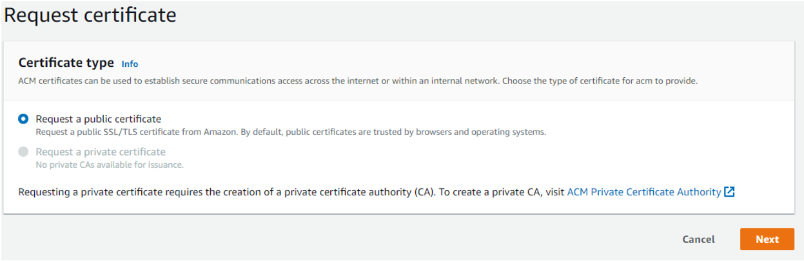
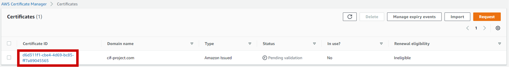
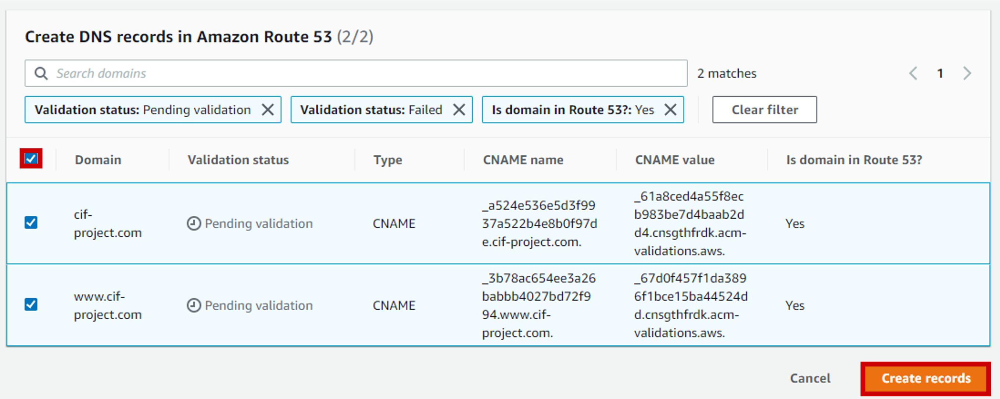
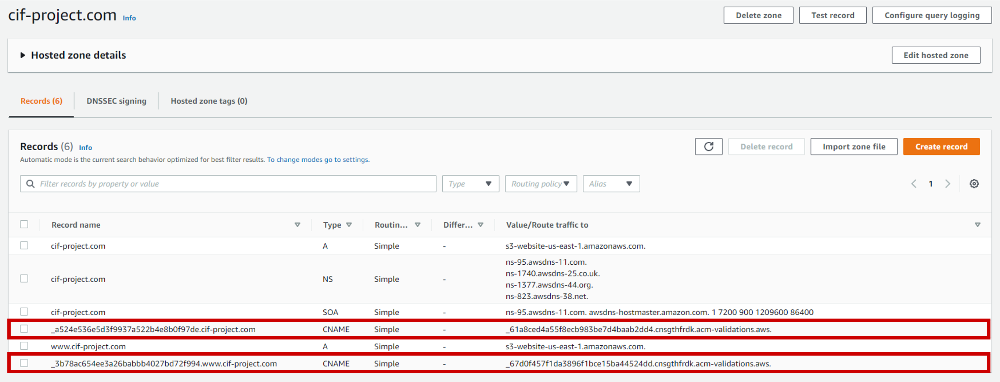

## Create a SSL certificate with AWS Certificate Manager

To create a SSL certificate for your website, first go to AWS Certificate Manager and **request a certificate**:

The certificate will be used on a public website, so you need to **request a public certificate**:

When applying for an SSL certificate, you are asked to fill in **Fully Qualified Domain Names** (known as FQDN). In your case, you have two FQDNs: the www domain name (e.g. *www<nolink>.cif-project.com*) and the non-www domain name (e.g. *cif-project.com*). Fill them both in this same certificate so that the connections by these two addresses are in HTTPS.

Next, you need to choose a validation method, proving that the domain you are creating a certificate for is really yours: imagine if anyone could create an SSL certificate for your site instead of you… your website would face huge security issues. I advise you to choose the recommended choice, **DNS validation**.

After that, all you have to do is validate the SSL Certificate creation request:

The certificate is created, but not yet validated; let’s check its configuration:

In the configuration of the certificate, you need to add two DNS records of type CNAME in your hosted zone. Lucky you, AWS takes care of this: all you have to do is, first, select **Create records in Route 53**:

Then select the two FQDNs and finally **Create records**:

All you have to do now is wait a few minutes until you see the **Success status**:

It's done, AWS has filled in the CNAME records for you. You can verify it by moving to your hosted zone:

Here they are, the two freshly added CNAME records, allowing you to validate the SSL certificate you just created.

Now that the certificate is ready: it's time to apply it to your website, and for that, you will need CloudFront.

### [Create and configure CloudFront distributions](/projects/project-1/part-7/README.md)