## Create and configure CloudFront distributions

By using CloudFront, you will be able to deploy your website in HTTPS, and get other benefits as using Edge locations to provide faster access to the website for the users.

CloudFront will act as a stepping stone between Route 53 and S3. In other words, the traffic from the website will be routed to a CloudFront distribution that will deliver it to the corresponding S3 Bucket.
You will create a CloudFront distribution for each of your S3 Bucket, two in total.

### A.	Main CloudFront distribution

Before creating your main CloudFront distribution, go to the main S3 Bucket, and copy the Bucket URL into **Properties tab**, **static website hosting section**:

Now, create your CloudFront distribution:

Have a first look at the **Origin section**.
When you click on the **Origin domain field**, a drop-down panel appears, where you can select links to the S3 Buckets:

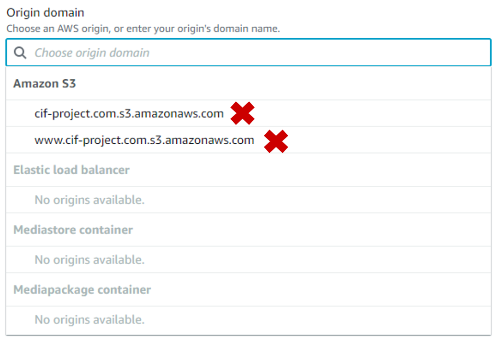

:warning: `Do NOT select them! Strange as it may seem, those are incorrectly filled in (there is a syntax error); instead, paste the Bucket URL you previously copied.`

Disable the **Origin Shield** to avoid additional charges. This is what the **Origin section** configuration should look like:

Let's move to the **Default cache behavior section**.
The only field to modify here is the **Viewer protocol policy**, where you choose to *Redirect HTTP to HTTPS*. All the traffic received in HTTP on port 80 will be redirected to HTTPS on port 443, so all connections made on both ports will be secure.

The **Default cache behavior section** should look like this:

Now let’s focus on the **Settings section**, and put some attention to **Price Classes**.

> There are three types of Price Class: **Price Class 100** (Edge locations from North America and Europe), **Price Class 200** (Edge locations North America, Europe, Asia, Middle East and Africa), and **Price Class All** (all Edge locations). The choice of the Price Class is therefore interesting since fewer Edge locations will be used in places where they cost less (see: https://aws.amazon.com/cloudfront/pricing/).

:warning: `The choice of Price Class has no impact on the Free Tier since you are allowed 2,000,000 HTTP and HTTPS requests from anywhere. As long as you don't exceed this value, no cost will be generated. But in best practice, choose the Price Class that suits your needs.`

In this example, since the use case is only for Europe and North America, the choice made is **Price Class 100**:

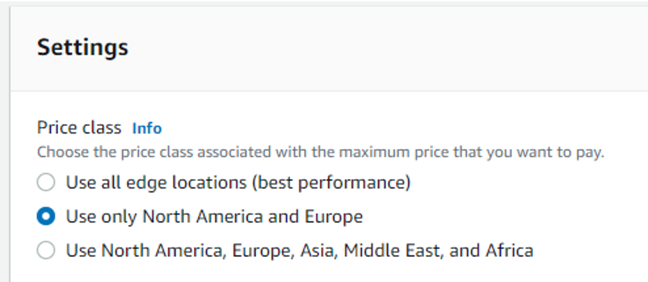

Fill in an **Alternate domain name (CNAME)** by inserting your main domain name:

In the **custom SSL certificate field**, select the newly created certificate:

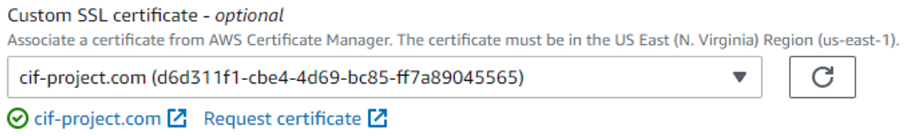

Leave the **Legacy clients support** *unselected* to avoid a nice bill of $600 at the end of the month:

Once all the necessary information are filled, you can now validate the creation of your main CloudFront distribution, and move on to creating the redirect CloudFront distribution.

### B.	Redirect CloudFront distribution

As you did earlier, before creating your redirect CloudFront distribution, go to the redirect S3 Bucket, and copy the Bucket URL into **Properties tab**, **static website hosting section**:

Now create your second CloudFront distribution. The configuration of the redirect CloudFront distribution will be almost the same, except for two details:
- The **Origin domain** will be the URL of the redirect S3 Bucket:

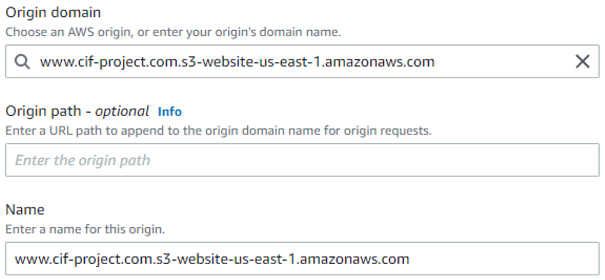

- The **Alternate domain name (CNAME)** will be the redirect domain:

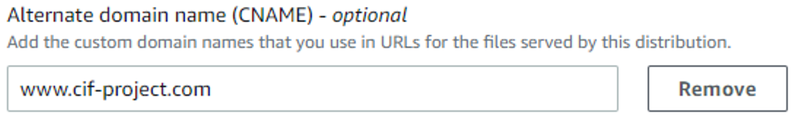

Once the configuration of your redirect distribution is complete, you can validate its creation.

You now have two CloudFront distributions. Wait a few minutes to let the distributions be validated and enabled.

In the meantime, jump to your redirect S3 Bucket, **Properties tab**, **static website hosting section**, not to copy the URL this time but to make one last modification: change the used **protocol** from HTTP to HTTPS:

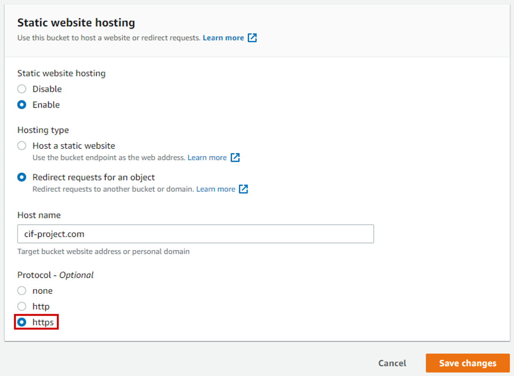

Go back to CloudFront, where you copy the web addresses of your CloudFront distributions (**Domain name field**) in the navigator search bar, in order to verify that you can access your site through these web addresses:

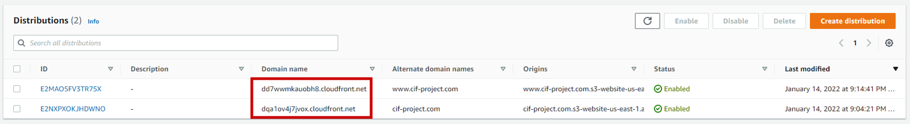

Start by copying the URL of the main CloudFront distribution:

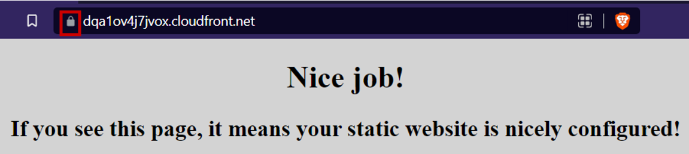

The website is accessible, and in HTTPS this time.
What about the redirect CloudFront distribution:

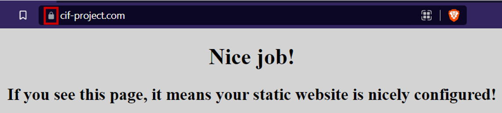

It works too, your website is now accessible in HTTPS.

:warning: `If the redirect CloudFront distribution displays the site in HTTP: keep in mind that you recently changed your redirect S3 Bucket to HTTPS. Wait ten good minutes and remember to clear your browser's cache before trying again.`

To finalize, head to Route 53 to make changes to the A records, so that the web addresses route traffic to your freshly created Cloudfront distributions:

The record for the main domain name should look like this:

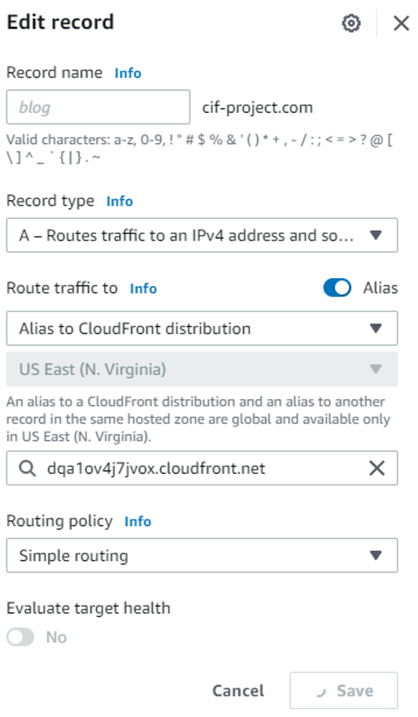

And the record for the redirect domain name should look like that:

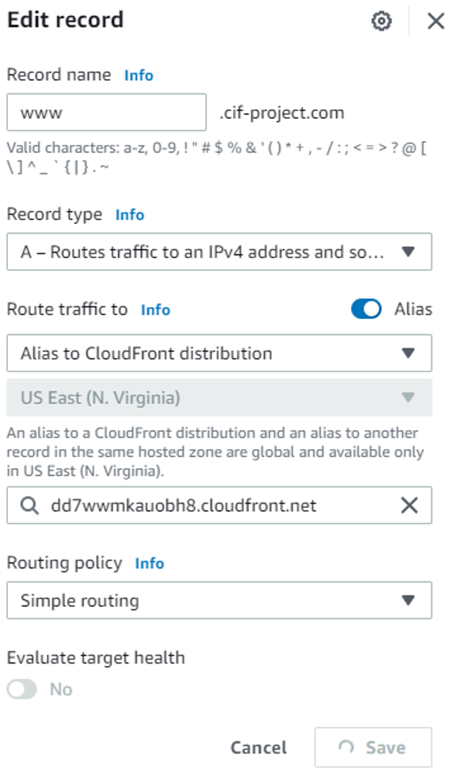

Time to make the final tests by accessing the website through HTTP URLs, to verify that the redirection to HTTPS is applied.

Let’s first check out the main domain in HTTP (*http<nolink>://cif-project.com*):

And now the redirect domain in HTTP (*http<nolink>://www<nolink>.cif-project.com*):

#### Congratulations, you now know how to set up a static website in HTTPS on AWS!

### [And the bill?](/projects/project-1/part-8/README.md)